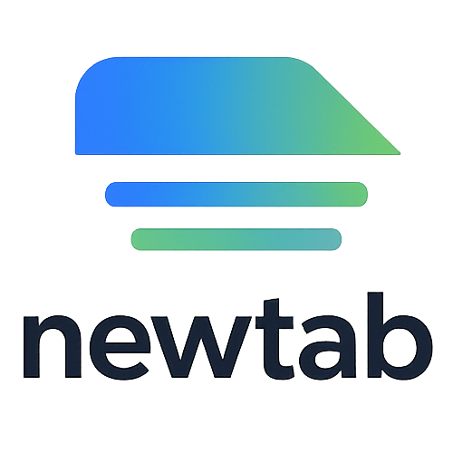
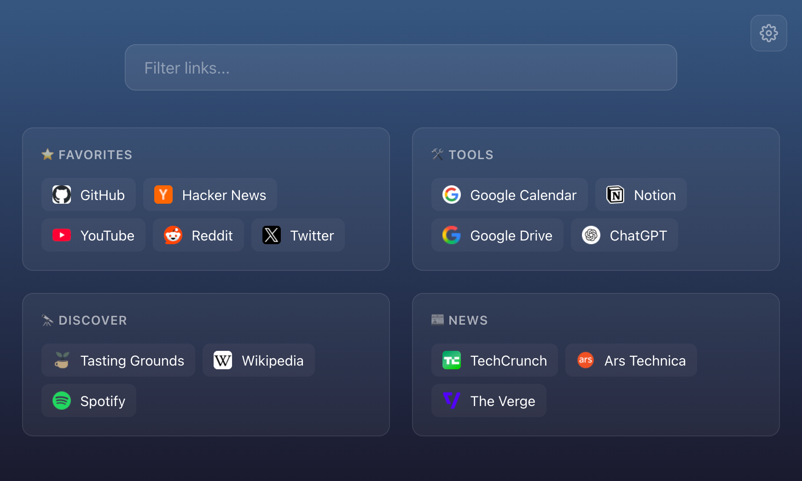

<p align="center">
  
</p>

# newtab

**[thenewtab.app](https://thenewtab.app)**

A minimal, customizable new-tab homepage built with React and TypeScript. Configuration is stored in the browser's localStorage and is fully editable from a built-in settings page. On first load, a default `config.json` is used to seed the initial config.

<p align="center">
  
</p>

## Installation

```bash
docker run -d \
  -p 3541:3541 \
  tastinggrounds/newtab
```

Then open http://localhost:3541. All configuration is managed from the built-in settings page.

## Development

```bash
npm install
npm run dev
```

Open http://localhost:3542 in your browser. Use the settings page to customize, or edit `public/config.json` to change the default seed config.

To simulate the hosted environment (as deployed to [thenewtab.app](https://thenewtab.app)):

```bash
VITE_HOSTED=true npm run dev
```

This enables hosted-only features like the attribution footer.

### Testing

```bash
npm run test          # run tests once
npm run test:watch    # run tests in watch mode
```

## Configuration

All configuration is managed from the built-in settings page:

- **General** — configure background image, overlay color, opacity, gradient, and search
- **Links** — add, remove, rename, and reorder sections and links
- **Subcommands** — add scoped shortcuts with predefined links or freeform URL arguments

Configuration is stored in the browser's localStorage. On first load, a default `config.json` seeds the initial config. You can also import/export the full config as a base64 string from the settings header.

Production builds also install a small service worker. After the first visit, it serves the cached app shell immediately while checking for an updated version in the background. The most recently displayed validated configuration is cached separately, so account initialization does not block the new-tab screen from rendering. Cache headers for both the Docker image and Cloudflare Pages keep the worker and HTML fresh while allowing fingerprinted assets to remain cached.

On [thenewtab.app](https://thenewtab.app), approved beta users can optionally sign in with an email code to sync their config across browsers. Signing in is not required: guest configs remain local to the browser, and signing out restores the browser's guest config. Self-hosted builds remain local-only by default.

For the full config file schema and examples, see [docs/config-file.md](docs/config-file.md).

Hosted deployment operators can configure optional account sync using [the sync setup guide](docs/sync-setup.md).

The dependency audit policy and Docker build-context hardening are described in [docs/security.md](docs/security.md).

## Docker

Build and run with Docker:

```bash
docker build -f docker/Dockerfile -t newtab .

docker run -d \
  -p 3541:3541 \
  newtab
```

Then open http://localhost:3541.

`.dockerignore` keeps your local `node_modules`, `dist`, and repository metadata out of the build context, so building from a working checkout is safe on any platform.

### Loading config via volume mount

You can optionally provide an initial `config.json` by volume-mounting it into the container. This is useful for seeding the config on first load or sharing the same config across multiple instances:

```bash
docker run -d \
  -p 3541:3541 \
  -v /path/to/your/config.json:/usr/share/nginx/html/config.json:ro \
  newtab
```

The volume-mounted config is used as the initial config on first load. Once the config is persisted to localStorage, the local copy takes precedence. You can also use the import/export feature in settings to transfer configs between browsers.

## Browser New Tab

To use this as your browser's new tab page, install the [Custom New Tab URL](https://chromewebstore.google.com/detail/custom-new-tab-url/mmjbdbjnoablegbkcklggeknkfcjkjia) extension (Chrome/Edge) and point it to where you're hosting the app.
